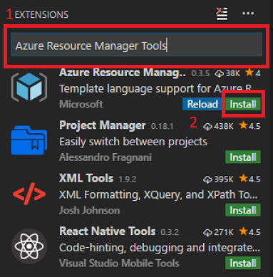

# Azure Stack Labs - Configure Tools

### Objective	

- Configure common development tools for Azure and Azure Stack.

### Prerequisites
- Windows 10 with the Azure PowerShell module installed
- Azure subscription (Sign up for a free account here. Needs a Microsoft account)

#### Install Visual Studio Code and extension
You'll install Visual Stode Code, and the Azure Resource Manager Tools extension to work with Azure Resource Manager templates.

1. Install [Visual Studio Code](https://code.visualstudio.com/Download).
2. Once installed, select "Extensions":

    
3. Search for "Azure Resource Manager Tools" and select "Install":

    

#### Install PowerShell
Azure Resource Manager PowerShell is used to manage Azure Resources using a familliar language.  In this step, you'll install PowerShell, and download the Azure Stack tools. 

Open an administrative PowerShell ISE session, and run the following:

```PowerShell
# Set the module repository and the execution policy
Set-PSRepository `
  -Name "PSGallery" `
  -InstallationPolicy Trusted

Set-ExecutionPolicy RemoteSigned `
  -force

# Uninstall any existing Azure PowerShell modules. To uninstall, close all the active PowerShell sessions and run the following command:
Get-Module -ListAvailable | `
  where-Object {$_.Name -like “Azure*”} | `
  Uninstall-Module

# Install PowerShell for Azure Stack
Install-Module `
  -Name AzureRm.BootStrapper `
  -Force

Use-AzureRmProfile `
  -Profile 2017-03-09-profile `
  -Force

Install-Module `
  -Name AzureStack `
  -RequiredVersion 1.2.10 `
  -Force 

# Download Azure Stack tools from GitHub
cd \

invoke-webrequest `
  https://github.com/Azure/AzureStack-Tools/archive/master.zip `
  -OutFile master.zip

expand-archive master.zip `
  -DestinationPath . `
  -Force

cd AzureStack-Tools-master
```
 
## Summary

In this module, you configured Visual Studio Code and PowerShell for Azure and Azure Stack, which you will use in future modules.


- [x] 1. [ARM Overview](/ARM%20Overview/README.md)
- [x] 2. [Configure Tools](/Configure%20Tools/README.md)
- [ ] 3. [Custom Policy](/Custom%20Policy/README.md)
- [ ] 4. Validate Templates
