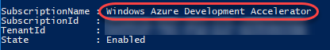
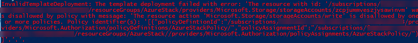
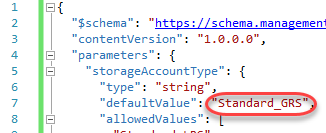
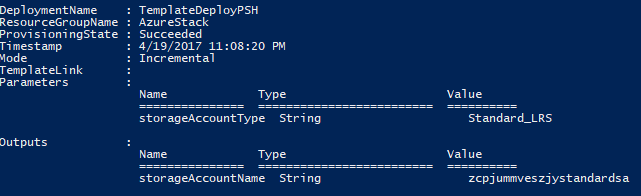

# Azure Stack Labs - Policy

### Overview

### Objectives	

- Create an Azure resource group and deploy and Azure Resource Manager template.
- Use the Azure Stack Policy module to constrain the resource group.
- Test the limits of the constrained resource group.
- Update the template for Azure Stack.

### Copy script
To follow the steps from this lab, run the following lines in a PowerShell session:


``` PowerShell
Invoke-RestMethod https://raw.githubusercontent.com/Azure/AzureStack-Labs/master/Policy/policy.ps1 ` 
-OutFile c:\temp\policy.ps1
PowerShell_ISE –file c:\temp\policy.ps1
```

> The command uses the backtick (`) in order to break a PowerShell command into multiple lines for the sake of printing. It is very important that the line break occur immediately after the tick and that there are no empty lines between the tick and the next section of the command to execute. If you are pasting this or other commands into PowerShell and getting errors, try pasting them into notepad first and cleaning up the result so that it matches the structure below. Then paste that into PowerShell.

## Task 1: Create an Azure resource group and deploy and ARM template
1. Open a PowerShell session and login to your Azure subscription by running the following command. Execute the command below to sign in to your Azure account. Sign in when prompted.

    ``` PowerShell
    Login-AzureRmAccount
    ```

2. In order to create a resource group, you’ll need to specify a subscription ID. Execute the command below to get a list of subscriptions associated with your account.

    ``` PowerShell
    Get-AzureRmSubscription
    ```

    > Make note of the name of the Azure subscription you would like to use for this lab.

    
 
3. Execute the command below to select the target subscription into context. All future commands will be executed against this newly selected subscription. Be sure to insert the name of your subscription where specified.

    ``` PowerShell
    $s = Select-AzureRmSubscription -SubscriptionName "[Your subscription name]"
    ```

4. Execute the command below to create a new resource group named "Azure Stack". This will be the resource group you constrain to support only what a real Azure Stack deployment will support.

    ``` PowerShell
    $resourceGroup = New-AzureRmResourceGroup -Name "AzureStack" -Location "West US"
    ```

5. Execute the command below to store the name of the resource group in the target variable. This will make it easier in the next step to build the path string to the resource group.

    ``` PowerShell
    $resourceGroupName = $resourceGroup.ResourceGroupName
    ```

6. Execute the block below to attempt to deploy to a resource group based on the target template. The template itself is very simple and only defines a single storage account to be created.

    ``` PowerShell
    Try {
    New-AzureRmResourceGroupDeployment -Name "NoPolicy" `
        -ResourceGroupName $resourceGroupName `
        -TemplateUri https://raw.githubusercontent.com/Azure/AzureStack-Labs/master/Policy/azuredeploy.json `
        -Verbose -ErrorAction Stop
    }
    Catch {
    Write-Host $_.Exception.Message -ForegroundColor Red
    }
    ```

## Task 2: Use the Azure Stack Policy module to constrain the resource group

1. AzureStack-Tools is a GitHub repository that hosts PowerShell modules and scripts that you can use to manage and deploy resources to Azure Stack. Execute the commands below to download and extract the tools to C:\AzureStack-Tools-master.

    ``` PowerShell
    invoke-webrequest https://github.com/Azure/AzureStack-Tools/archive/master.zip -OutFile master.zip
    expand-archive master.zip -DestinationPath c:\ -Force
    ```

2. Execute the command below to switch to the Azure Stack tools directory.

    ``` PowerShell
    cd c:\AzureStack-Tools-master
    ```

3. Execute the command below to import the Policy module.

    ``` PowerShell
    import-module .\Policy\AzureStack.Policy.psm1
    ```

4. Execute the command below to create a new policy definition based on the default Azure Stack policy.

    ``` PowerShell
    $policy = New-AzureRmPolicyDefinition -Name AzureStackPolicy -Policy (Get-AzureStackRmPolicy)
    ```

5. Execute the commands below to assign the newly created policy to the resource group. Now deployments will be restricted based on what Azure Stack supports.

    ``` PowerShell
    New-AzureRmPolicyAssignment -Name AzureStackPolicy -PolicyDefinition $policy -Scope $ResourceGroup.ResourceId
    ```

## Task 3: Test the limits of the constrained resource group
1. Execute the block below to attempt to deploy to a resource group based on the target template. The template itself is very simple and only defines a single storage account to be created. However, it requires a setting not available in Azure Stack, so it is destined to fail.

    ``` PowerShell
    Try {
    New-AzureRmResourceGroupDeployment -Name "Policy" `
        -ResourceGroupName $resourceGroup.ResourceGroupName `
        -TemplateUri https://raw.githubusercontent.com/Azure/AzureStack-Labs/master/Policy/azuredeploy.json `
        -Verbose -ErrorAction Stop
    }
    Catch {
    Write-Host $_.Exception.Message -ForegroundColor Red
    }
    ```
2.	The failure should happen almost immediately. Note that it specifies that something associated with the storage account creation defies the assigned policy.

    
 
## Task 4: Update the template for Azure Stack
1.	Donwload a copy of the ARM template.

    ``` PowerShell
    $localTemplate = "c:\temp\azuredeploy.json"
    Invoke-RestMethod https://raw.githubusercontent.com/Azure/AzureStack-Labs/master/Policy/azuredeploy.json `
    -OutFile $localTemplate
    ```

2. Open c:\temp\azuredeploy.json in Visual Studio. Locate the line with Standard_GRS (around line 7). This setting (geo-redundant storage) is not available in Azure Stack, so the policy rejected it. Change it to "Standard_LRS" (locally-redundant storage) and save the file.

    
 
3. Return to PowerShell and execute the deployment again. 

    ```PowerShell
    Try {
    New-AzureRmResourceGroupDeployment -Name "Fixed" `
        -ResourceGroupName $resourceGroup.ResourceGroupName `
        -TemplateFile $localTemplate `
        -Verbose -ErrorAction Stop
    }
    Catch {
    Write-Host $_.Exception.Message -ForegroundColor Red
    }
    ```
    
It should not fail this time. It may take a minute for the creation to complete. You now have a deployment up and running in Azure based on a template that will also work in your Azure Stack deployment.


        
## Summary

In this lab, you’ve learned how to use the Azure Stack Policy module to constrain an Azure resource group to the capabilities available in Azure Stack. Proceed to the next lab.
 
- [x] 1. [ARM Overview](/ARM%20Overview/README.md)
- [x] 2. [Configure Tools](/Configure%20Tools/README.md)
- [x] 3. [Custom Policy](/Custom%20Policy/README.md)
- [ ] 4. [Validate Templates](/Validate%20Templates/README.md) 


### Additional Resources
If you are interested in learning more about this topic, you can refer to the following resources:
- Documentation: https://azure.microsoft.com/en-us/overview/azure-stack/
- GitHub SDK: https://github.com/Azure/AzureStack-Tools
- Team blog: https://azure.microsoft.com/en-us/blog/tag/azure-stack/
