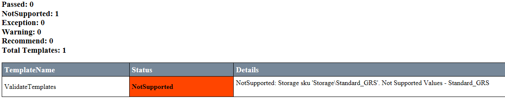

# Azure Stack Labs - Validate Templates

### Objective	

- Use the Azure Stack template validator to identify versioning incompatibilities.

### Copy script
To follow the steps from this lab, run the following lines in a PowerShell session:

``` PowerShell
md c:\AzureStack_Labs\ValidateTemplates\
Invoke-RestMethod "https://raw.githubusercontent.com/Azure/AzureStack-Labs/master/Validate%20Templates/validate.ps1" `
-OutFile c:\AzureStack_Labs\ValidateTemplates\validate.ps1
PowerShell_ISE –file c:\AzureStack_Labs\ValidateTemplates\validate.ps1
```

## Task 1:  Validate template
In these steps, you validate a template by using the AzureRM.TemplateValidator PowerShell module.  This tool will identify common template inconsistencies that must be addressed for template portability between Azure and Azure Stack. You will use the same template from the previous step, and will see the same changes highlighted.   

1. Download the Azure Resource Manager template with this PowerShell:

```PowerShell
    Invoke-WebRequest -uri "https://raw.githubusercontent.com/Azure/AzureStack-Labs/master/Validate%20Templates/azuredeploy.json" `
    -OutFile c:\AzureStack_Labs\ValidateTemplates\azuredeploy.json
```

2.  Import the AzureRM.TemplateValidator.psm1 PowerShell module:
    
    ```PowerShell
    cd \AzureStack-Tools-master\TemplateValidator
    import-module .\AzureRM.TemplateValidator.psm1
    ```

3.  Run the template validator:

    ```PowerShell
    Test-AzureRMTemplate -TemplatePath c:\AzureStack_Labs\ValidateTemplates\azuredeploy.json `
    -CapabilitiesPath AzureStackCloudCapabilities_with_AddOns_20170627.json `
    -IncludeStorageCapabilities `
    -Verbose
    ```

4.  Open the HTML report from [C:\AzureStack-Tools-master\TemplateValidator\TemplateValidationReport.html](file:///C:/AzureStack-Tools-master/TemplateValidator/TemplateValidationReport.html).

      

## Summary
You have used the template validator to identify templates which may not be portable to Azure Stack.  

- [x] 1. [ARM Overview](/ARM%20Overview/README.md)
- [x] 2. [Configure Tools](/Configure%20Tools/README.md)
- [x] 3. [Custom Policy](/Custom%20Policy/README.md)
- [x] 4. [Validate Templates](/Validate%20Templates/README.md)

